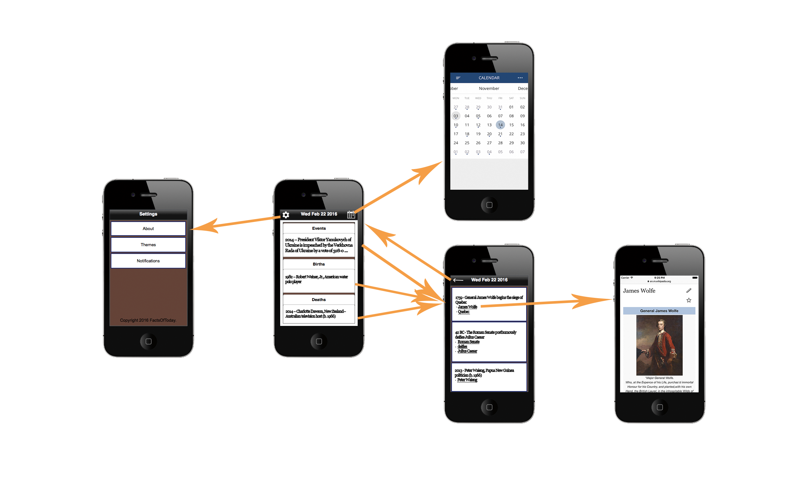

# FactsOfToday
Takes the user's current date, and displays different information that happened on the same day.

Link to the Google Folder with all the documents
https://docs.google.com/document/d/1igLWQiPm7hl5luzI21SjwbPIfBHDC8UXhIl9UfTw4cU/edit?usp=sharing

#Required User Stories:

* As a user I would like the app to open and search for today’s date by default.
* As a user I would like to see preview of the three categories on the main screen: events, births, deaths.
* As a user I would like to tap the preview to go to a table view that lists more items in that category for that day.
* As a user I would like to tap the links available in each cell to open a modal Safari view of the related Wikipedia page.
* As a user I would like to swipe left and right on the main page to switch to adjacent dates.
* As a user I would like to open a calendar view to pick from further dates more quickly.
* As a user I would like to tap the ‘today’ button to get back to the current day.

#Optional User Stories:

* As a user I would like to select color schemes
* As a user I would like to use the 6s force touch to push and pop article links.
* As a user I would like to see images from Wikipedia API on the tableview before opening the links
* As a user I would like to be able to choose to receive a daily event notification.
* As a user I would like my date selection to persist until the next day

# Wireframe

